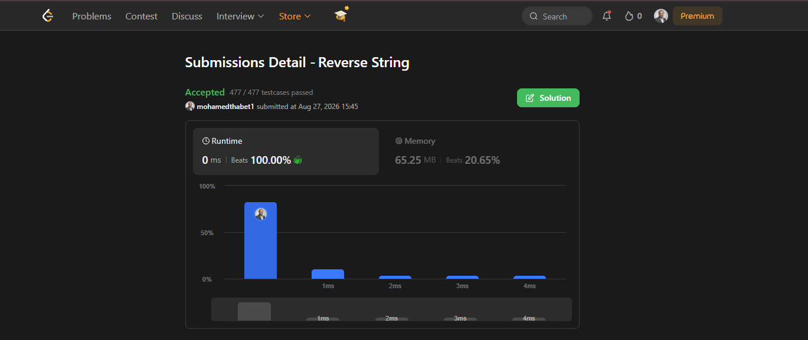

# LeetCode - Reverse String

## Problem

Reverse String

## Language

C#

## Approach

Two Pointers

## Solution

```csharp
public class Solution
{
    public void ReverseString(char[] s)
    {
        int left = 0;
        int right = s.Length - 1;

        while (left < right)
        {
            char temp = s[left];

            s[left] = s[right];
            s[right] = temp;

            left++;
            right--;
        }
    }
}
```

## Explanation

The solution uses the Two Pointers approach.

- `left` starts at the beginning of the array.
- `right` starts at the end of the array.
- The characters at `left` and `right` are swapped.
- `left` moves one position forward.
- `right` moves one position backward.
- The process continues until the two pointers meet.

The input `char[]` is modified in place without using a built-in reverse method.

## Complexity

- Time Complexity: O(n)
- Space Complexity: O(1)

## Submission Result

The solution was submitted successfully on LeetCode and received **Accepted**.

### Submission Link

https://leetcode.com/submissions/detail/2121894780/
Accepted submission screenshot:

